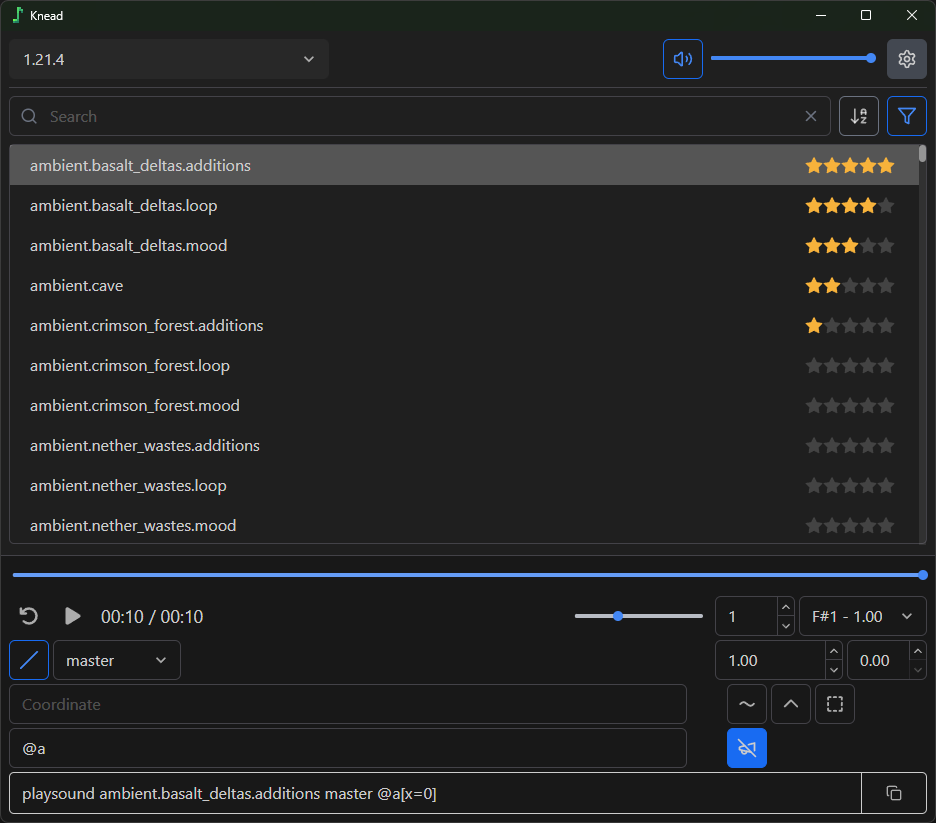

# Knead
Minecraftの`/playsound`コマンドを容易にするためのデスクトップアプリ

A desktop app that lets you easily create Minecraft `/playsound` commands

<!-- ライトモード/ダークモードへ対応 -->

# Supported
### 大感謝　　　Thank you so so so so so much
### [@ChenCMD](https://github.com/ChenCMD)

# Feedback

[Create Issue](https://github.com/nea-c/Knead/issues/new)